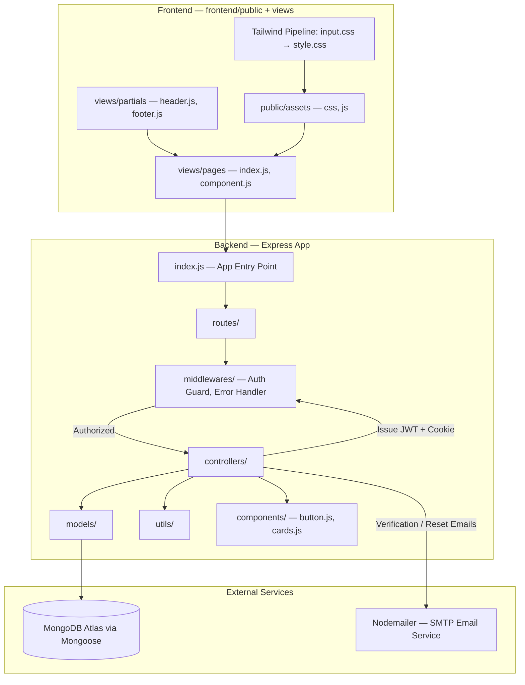
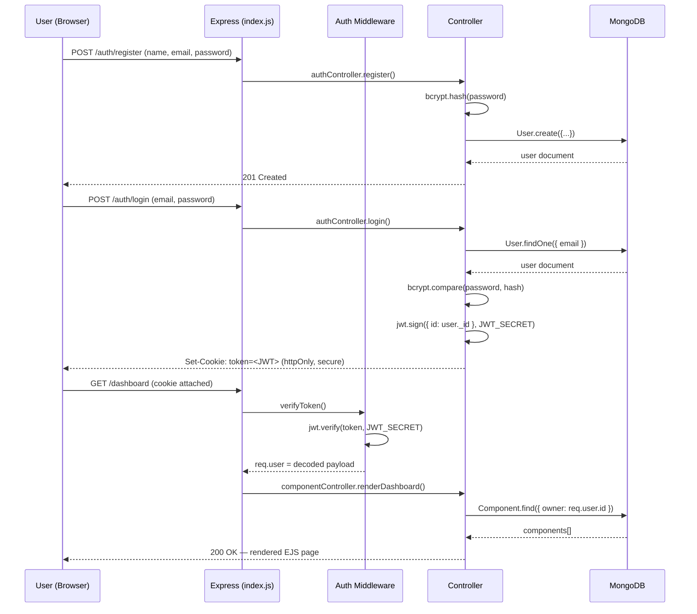
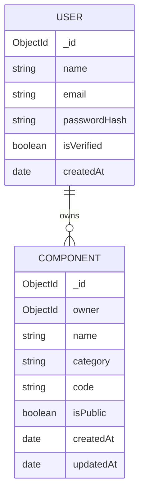
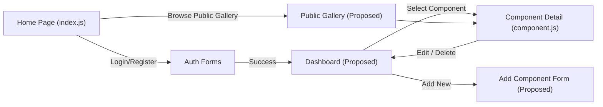
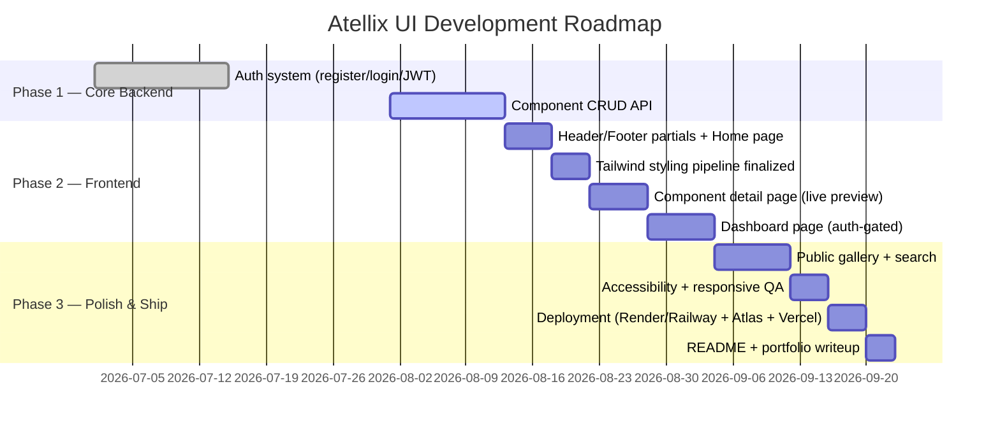

# Atellix UI — Product Requirements Document (PRD)

**Document Owner:** Uditya Pal
**Role:** Full-Stack Developer (MERN) — MCA Candidate, Galgotias University (2024–2026)
**Location:** Noida, Uttar Pradesh, India
**GitHub:** https://github.com/Uditya-Pal-1
**LinkedIn:** linkedin.com/in/udityapal
**Document Version:** 2.0
**Status:** Active Development
**Last Updated:** August 2026

---

## 1. Executive Summary

**Atellix UI** is a full-stack, authenticated component library platform built on the MERN-adjacent stack (MongoDB, Express, Node.js, with server-rendered EJS views and Tailwind CSS on the frontend). It gives developers a personal, secure workspace to create, store, preview, and reuse UI components — buttons, cards, and beyond — instead of rebuilding the same interface elements across every new project.

The name **Atellix** is an invented, brandable term with no prior dictionary meaning — a deliberate choice that reads as a polished, standalone product name (similar in register to names like "Vercel" or "Notion") rather than a literal description. Paired with "UI," it signals precision-engineered interface tooling.

This document is the **single source of truth** for what Atellix UI is, who it serves, and what must be true for it to be considered complete, professional, and portfolio-ready.

> **Terminology:** A PRD is *prescriptive* — it defines the target state, not just the current one. Sections marked **(Proposed)** describe intended behavior that may not yet be fully implemented; treat those as your build checklist.

---

## 2. Problem Statement

Developers — particularly students and early-career engineers building multiple personal or academic projects — face a recurring inefficiency:

- The same UI primitives (buttons, cards, modals, form inputs) are rebuilt from scratch, or copy-pasted inconsistently, across every new project.
- There is no lightweight, self-owned, authenticated system to catalog and retrieve these components on demand.
- Public design systems (Material UI, Chakra, shadcn/ui) are powerful but heavy, opinionated, and not "yours" — they don't showcase your own engineering ability.

**Atellix UI addresses this** by giving developers a personal, secure, self-built component vault — proving full-stack competency (auth, database design, server rendering, styling pipeline) while solving a genuine day-to-day workflow problem.

---

## 3. Goals & Objectives

| Objective | Measurable Outcome |
|---|---|
| Deliver a secure, production-style authentication system | Register, login, logout, and session persistence via JWT stored in `httpOnly` cookies; passwords hashed with bcrypt |
| Build a functioning component management system | Full CRUD on components, scoped to the authenticated user |
| Demonstrate a clean, layered backend architecture | Strict separation across `routes/`, `controllers/`, `middlewares/`, `models/`, `utils/` |
| Ship a coherent, styled frontend | Server-rendered views (EJS) styled with a Tailwind CSS build pipeline (`input.css` → `style.css`) |
| Produce professional-grade documentation | This PRD + a public README + inline code comments |
| **(Stretch)** Differentiate beyond a CRUD app | Public/private visibility, tagging, live component preview, search |

---

## 4. Target Users & Personas

**Primary Persona — "The Builder" (you, and developers like you)**
A student or early-career full-stack developer who ships multiple side projects and wants a personal, reusable component vault rather than starting from zero each time.

**Secondary Persona — "The Small Team Lead"**
A student project group or small dev team that wants a shared, lightweight component reference without adopting a heavyweight design system.

**Tertiary Persona — "The Visitor"** *(Proposed)*
An unauthenticated visitor browsing a public gallery of components for inspiration or direct code reuse.

---

## 5. Competitive Landscape (Brief)

| Product | Strength | Why Atellix UI Still Has a Place |
|---|---|---|
| CodePen | Huge public community | No personal auth-gated private vault by default |
| UI Garden / UIverse | Large free component catalog | Not self-owned; can't extend the backend yourself |
| shadcn/ui | Excellent DX, copy-paste components | A frontend-only library, not a full-stack product with your own auth/DB layer |

Atellix UI's differentiator isn't scale — it's that it is **fully self-owned infrastructure**: your auth system, your database, your API, your styling pipeline.

---

## 6. System Architecture



### 6.1 Authentication Sequence



### 6.2 Entity Relationship Diagram



---

## 7. Full Folder Structure — Backend & Frontend

```
Atellix-UI/
├── backend/
│   ├── components/              # Default/seed UI component templates
│   │   ├── button.js
│   │   └── cards.js
│   ├── controllers/             # Business logic per resource (auth, components)
│   ├── middlewares/             # JWT auth guard, centralized error handler
│   ├── models/                  # Mongoose schemas (User, Component)
│   ├── routes/                  # Express route definitions
│   ├── utils/                   # Token helpers, email templates, validators
│   ├── node_modules/
│   ├── .env                     # DB URI, JWT secret, SMTP credentials (gitignored)
│   ├── .env.sample              # Documented template of required env vars
│   ├── .gitignore
│   ├── index.js                 # App entry — DB connection, middleware, server boot
│   ├── package.json
│   └── package-lock.json
│
└── frontend/
    └── public/
        ├── assets/
        │   ├── css/
        │   │   ├── input.css      # Tailwind source file (@tailwind directives)
        │   │   └── style.css      # Compiled Tailwind output — served to browser
        │   └── js/
        │       └── main.js        # Client-side interactivity (form handling, previews)
        └── views/
            ├── pages/
            │   ├── index.js        # Landing / home page template
            │   └── component.js    # Component detail / preview page template
            └── partials/
                ├── header.js       # Shared navigation bar
                └── footer.js       # Shared footer
```

**Architectural notes:**
- The backend follows a **layered MVC pattern**: routes never contain logic, controllers never touch the database directly beyond calling models, and models never know about HTTP. This makes each layer independently testable.
- The **Tailwind pipeline** (`input.css` → `style.css`) implies a build step (`npx tailwindcss -i input.css -o style.css --watch`) should exist in `package.json` scripts — confirm this is present, since it wasn't visible in the earlier `package.json` review.
- `views/pages` and `views/partials` being `.js` files (rather than `.ejs`) is worth double-checking: if you are rendering with the `ejs` package (present in your dependencies), templates should typically use the `.ejs` extension. If these are instead JS modules generating HTML strings, document that pattern explicitly so future contributors aren't confused.

---

## 8. UI/UX Overview

### 8.1 Page Inventory

| Page / Partial | File | Purpose | Auth Required |
|---|---|---|---|
| Home | `views/pages/index.js` | Landing page — product intro, call-to-action to log in/register | No |
| Component Detail | `views/pages/component.js` | View a single component's code, preview, and metadata | Depends on visibility (public/private) |
| Header | `views/partials/header.js` | Persistent navigation — logo, links, login/logout state | N/A (shared) |
| Footer | `views/partials/footer.js` | Persistent footer — links, credits | N/A (shared) |
| **(Proposed)** Dashboard | `views/pages/dashboard.js` | Logged-in user's personal component list | Yes |
| **(Proposed)** Login/Register | `views/pages/auth.js` | Auth forms | No |

### 8.2 Navigation Flow



### 8.3 Design System Notes

- **Styling engine:** Tailwind CSS, compiled via CLI from `input.css`. Keep custom design tokens (colors, spacing, font sizes) defined in `tailwind.config.js` rather than hardcoded utility strings, so the visual identity of Atellix UI stays consistent as pages are added.
- **Shared shell:** `header.js` and `footer.js` as partials ensures a consistent frame across every page — this is good practice and should be preserved as new pages are added.
- **Component previews:** Each component (button, card) should render a **live preview** alongside its raw code — this is the core value proposition of the product and deserves the most UI polish.
- **Accessibility baseline:** Ensure sufficient color contrast (WCAG AA), visible focus states on interactive elements, and semantic HTML in partials (`<header>`, `<footer>`, `<nav>`) rather than generic `<div>`s.

---

## 9. Functional Requirements

### 9.1 Authentication
- **FR1:** Register with name, email, password (bcrypt-hashed)
- **FR2:** Login issues a JWT stored in an `httpOnly`, `secure` cookie
- **FR3:** Logout clears the auth cookie
- **FR4:** Protected routes/pages reject unauthenticated requests (redirect to login)
- **FR5:** Email verification and/or password reset via Nodemailer

### 9.2 Component Management
- **FR6:** Authenticated users can create a component (name, category, code, live preview markup)
- **FR7:** Users can view their own components in a dashboard
- **FR8:** Users can update or delete components they own
- **FR9:** Components can be flagged `public` or `private`
- **FR10:** Public components are browsable without authentication

### 9.3 Frontend Experience
- **FR11:** Consistent header/footer shell across all pages
- **FR12:** Component detail page renders both code and live visual preview
- **FR13:** Responsive layout — usable on mobile, tablet, and desktop viewports
- **FR14:** Clear, styled error and success states for forms (login, register, add component)

---

## 10. Non-Functional Requirements

| Category | Requirement |
|---|---|
| **Security** | Passwords never stored in plaintext (bcrypt); secrets isolated to `.env`; JWTs signed with a strong secret and reasonable expiry |
| **Performance** | API responses under ~300ms for standard CRUD; compiled Tailwind CSS kept minimal via purge/content config |
| **Reliability** | Centralized error-handling middleware — no unhandled exceptions crash the server |
| **Usability** | Clear validation feedback on all forms; no silent failures |
| **Accessibility** | WCAG AA color contrast; semantic HTML; keyboard-navigable forms |
| **Maintainability** | Consistent naming conventions; `.env.sample` always kept current; comments on non-obvious logic |
| **Portability** | CORS configured correctly if frontend and backend ever run on separate origins/ports |

---

## 11. Tech Stack

| Layer | Technology | Version | Purpose |
|---|---|---|---|
| Runtime | Node.js | — | JavaScript server runtime |
| Framework | Express | 5.2.1 | HTTP server & routing |
| Database | MongoDB + Mongoose | 9.9.2 | Document-based data persistence |
| Auth | jsonwebtoken | 9.0.3 | Stateless session tokens |
| Auth | bcryptjs | 3.0.3 | Password hashing |
| Session | cookie-parser | 1.4.7 | Reading JWT from `httpOnly` cookies |
| Views | EJS | 6.0.1 | Server-side rendered templates |
| Styling | Tailwind CSS | — (inferred from `input.css`) | Utility-first CSS, compiled to `style.css` |
| Email | Nodemailer | 9.0.5 | Verification & notification emails |
| Config | dotenv | 17.4.2 | Environment variable management |
| Cross-origin | cors | 2.8.6 | Controlled cross-origin access |
| Dev tooling | nodemon | 3.1.14 | Auto-restart during development |

---

## 12. API Surface (Proposed)

| Method | Endpoint | Auth | Description |
|---|---|---|---|
| POST | `/api/auth/register` | No | Create a new user account |
| POST | `/api/auth/login` | No | Authenticate, set JWT cookie |
| POST | `/api/auth/logout` | Yes | Clear the session cookie |
| GET | `/api/auth/me` | Yes | Return current authenticated user |
| GET | `/api/components` | Yes | List the current user's components |
| GET | `/api/components/public` | No | List all public components |
| GET | `/api/components/:id` | Depends on visibility | Get a single component |
| POST | `/api/components` | Yes | Create a new component |
| PUT | `/api/components/:id` | Yes (owner only) | Update a component |
| DELETE | `/api/components/:id` | Yes (owner only) | Delete a component |

---

## 13. Success Metrics

| Metric | Target |
|---|---|
| Core auth flow (register → login → protected page) | Fully functional, zero critical bugs |
| Component CRUD | All four operations working and scoped correctly per user |
| Deployment | Live, publicly accessible demo link |
| Documentation | This PRD + README both complete and accurate |
| Code quality | Consistent structure across all controllers/routes; no dead code |

---

## 14. Roadmap



---

## 15. Risks & Open Questions

- **Confirm rendering approach:** `views/pages` and `views/partials` are `.js` files while `ejs` is a listed dependency — clarify whether these are `.ejs` templates mislabeled, or JS modules that generate/return HTML. Document whichever pattern is real.
- **Confirm Tailwind build script:** `input.css`/`style.css` implies a Tailwind CLI build step should exist in `package.json` — verify it's present and documented in the README (`npm run build:css` or similar).
- **Seed vs. dynamic components:** Decide whether `backend/components/button.js` and `cards.js` remain static seed templates or get fully absorbed into the `Component` MongoDB model as the system matures.
- **No paid infrastructure:** Plan entirely around free tiers — MongoDB Atlas (free cluster), Render or Railway (free web service tier), Vercel/Netlify (frontend hosting, if split out later).

---

## 16. Glossary — Professional & Technical Vocabulary

Useful terms to internalize while working on and discussing this project — in code reviews, documentation, and interviews alike:

| Term | Meaning |
|---|---|
| **Idempotent** | An operation that yields the same result no matter how many times it is executed — relevant when designing `PUT`/`DELETE` endpoints |
| **Ephemeral** | Short-lived by design — e.g., a JWT with a defined expiry, or a temporary session |
| **Decouple** | To structure code so components don't depend tightly on one another — the purpose of separating routes, controllers, and models |
| **Scaffold** | The initial skeleton of a project or feature, built before full functionality is added |
| **Latency** | The time delay between a request being sent and a response being received |
| **Granular** | Broken into small, precise units — e.g., "granular access control" per resource |
| **Idempotency key** | A unique identifier used to ensure a request isn't processed twice — common in payment and form-submission systems |
| **Middleware** | A function that sits between the request and final handler, able to inspect, modify, or reject it — the mechanism behind your auth guard |
| **Schema** | The defined structure/shape of your data — what your Mongoose models enforce |
| **Purge (CSS)** | Removing unused CSS classes from a production build — a standard Tailwind optimization step |

---

*End of Document — Atellix UI PRD v2.0*
